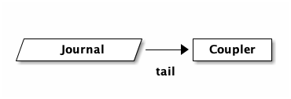
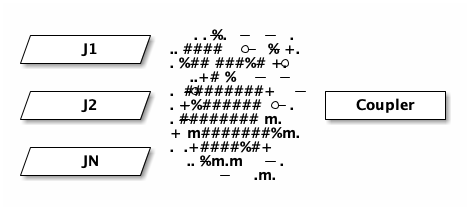
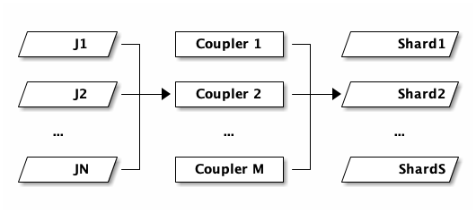

#+title: Aurora DSQL: Meet Coupler
#+setupfile: ../templates/level0.org
#+date: <2026-05-13 Wed>
#+options: ^:{}

* Aurora DSQL: Meet Coupler

/AKA: CDC streaming in Aurora DSQL./

From /the [[file:dsql-circle-of-life.org][Circle of Life]]/:

#+begin_quote
In DSQL, data is durably persisted when it's written to the /journal/. Storage
follows the journal, and keeps itself up to date.
#+end_quote

If you have a /journal/ component that holds an ordered, durable log of every
committed transaction, then a question quickly comes up: who else can follow the
journal? Storage does, but storage is just one consumer. Could other things be
consumers too?

We've been getting asks for Change Data Capture (CDC) since well before we
launched. Customers want a downstream service that reacts to events. Or to
feed an analytics warehouse. Or a search index. CDC is hard on a lot of databases. You
end up reading the write-ahead log out-of-band (and hoping nobody truncates it
before you catch up), or running triggers that write to a side table (which
puts load on every foreground transaction), or polling (which puts load on
the database /and/ delays delivery).

In DSQL, we had a head start. We didn't have to invent a stream of changes,
because the journal /is/ that stream. We just had to publish it somewhere
useful.

This post is about the service that does the publishing. We call it *Coupler*.
Today we're announcing the Public Preview of CDC for DSQL. DSQL is now capable
of delivering "near real-time" changes to [[https://aws.amazon.com/kinesis/data-streams/][Amazon Kinesis Data Streams]] (KDS). In
today's article, we're going to take a look at how the Coupler works, and how
the integration with KDS works.

** Creating a stream

Before we get into how Coupler works, let's see what the user experience looks
like. I'm going to focus on the key steps, since the point of this article is
to help you understand what we've built and how it works. For reference, [[https://docs.aws.amazon.com/aurora-dsql/latest/userguide/cdc-setup.html][Getting
started with CDC streams]] is the place to go.

First, you create a KDS stream:

#+begin_src sh
aws kinesis create-stream \
  --stream-name my-cdc-stream \
  --stream-mode-details StreamMode=ON_DEMAND \
  --max-record-size-in-kib 10240
#+end_src

Then, you tell DSQL where to publish it:

#+begin_src sh
aws dsql create-stream \
    --cluster-identifier cluster-id \
    --target-definition '{"kinesis":{"streamArn":"kinesis-stream-arn","roleArn":"role-arn"}}' \
    --ordering UNORDERED \
    --format JSON \
    --tags '{"Name":"my-cdc-stream"}'
#+end_src

You will also need to explicitly grant DSQL the permission to write to this
stream. I know that IAM is sometimes a barrier to getting started on AWS, but I
really like that AWS services don't have some kind of special access to your
data. All permissions are explicit; you're in control.

After setting this up, DSQL will start to deliver change events to your KDS
stream, and you can do whatever you want with them.

Now, you're probably wondering.. "what's in the stream?" - before we get into
that, let's talk about how the Coupler works.

** Tail

When you create a DSQL stream, you're really sending an instruction to the
Coupler to start to /tail/ your cluster's journal. This is how the Coupler
learns about transactions:

#+header: :exports results
#+begin_src ditaa :file images/coupler-tail.png :noeval

+--------------+      +---------+
|{io}Journal   |----->| Coupler |
+--------------+      +---------+
                 tail
#+end_src

#+RESULTS:

Seems simple enough, but the reality is much more complex. A cluster running at
high throughput may have many journals. DSQL will add and remove journals
transparently to ensure you have enough commit bandwidth. The journal has many
subscribers. This means the Coupler would need to connect to multiple journals
to ensure it sees everything, and deal with journals coming and going. If it
gets it wrong, it could miss transactions. If the Coupler is unavailable for a
period of time, then what? Do we need to buffer in the journal, potentially
slowing the system down or causing an outage?

This is a really hard problem. Fortunately for us, we've already solved it.
Remember that DSQL's storage layer is also subscribing to the journal in this
picture - that's how DSQL is serving reads for =SELECT= queries. DSQL already
has a high throughput low latency subscription fan-out service. I haven't
detailed it yet on this blog, but for now you can think of it as a magical box
that gives the Coupler everything it wants:

#+header: :exports results
#+begin_src ditaa :file images/coupler-tail-fanout.png :noeval
+-----------+   .+.-%.- -- .
|{io} J1    |  ..+####*-%-+.
+-----------+  . %##*###%#*+.
                 ..+#*%-- -
+-----------+  .-*########+-- +-----------+
|{io} J2    |  .-+%######*-.  |  Coupler  |
+-----------+  .-########*m.  +-----------+
               + m#######%m.
+-----------+  .++.+####%#+
|{io} JN    |   ..-%m.m+--.
+-----------+       -  .m.
#+end_src

#+RESULTS:

/The ASCII spray can was the best I could come up with./

Later in this article, we'll talk about scaling the Coupler. For now, simply
understand that we're building on something that already exists, and is
/downstream/ from the commit path. This magical fan-out service already has to
deal with slow or unavailable storage hosts, and all the other hard problems
that we've solved when we fully decoupled the read and write paths of our
system.

This is /great/. It means that we can truly offer CDC in a way that never breaks
the database. We can add as many streams as we need. Every investment we make to
lower latency or cost pays off for our storage layer as well as for CDC (and
other things we'll be releasing in the future).

That's the input side, let's talk about the output next.

** Publish

The DSQL journal is formatted in a way that we (the DSQL team) chose. We picked
a serialization format and ordering semantics. We optimized for speed, for
cost. And, over time, we've tweaked that format. We want to be able to continue
to iterate on it under our own steam.

Meanwhile, customers want what customers want. And they want it where they want
it. This, at some level, is the core job of the Coupler - to take data in the
DSQL journals and put it somewhere else, in some other format.

Conceptually, the Coupler supports multiple /sinks/: destinations where we can
publish to. Each sink has different capabilities - what it can support, or how
it wants to be used. Does it allow for different formats? Does it want
individual records, or does it want big batches? What about ordering, or
de-duplication?

The Coupler can be configured to handle different sinks and their quirks - and
this configuration is expressed in our =create-stream= API.

The simplest example of this is =--format JSON=, which controls how Coupler
/serializes/ its output. As already mentioned, our first sink is KDS. KDS allows
you to put whatever blob you want, and so we could conceptually support =CSV= or
=XML= (I know.. this is what you all truly want, right?). Other sinks may
require a specific format.

Another example is =--ordering UNORDERED=. KDS does have ordering capabilities,
but in our experience it works best when you build your consumer around an
unordered stream. This forces you to be idempotent early in your implementation,
which is not actually that difficult to accomplish and is often necessary
anyways.

In the future, we will offer additional ordering options. Maybe you want total
order, or maybe you just want total order per-row. Maybe those orderings will be
supported on KDS, or not. It depends on what customers ask us to prioritize.
[[https://docs.aws.amazon.com/aurora-dsql/latest/userguide/providing-feedback.html][Providing Feedback]] is where you want to go. Discord if you can; our engineers
love to hear from customers directly.

You'll notice that both =format= and =ordering= are required parameters with
only one option. This may be a little weird at first blush, but it's
intentional. We're not sure what the defaults should be, and it's a breaking
change to change defaults. As we add additional CDC capabilities, you should
expect to see more options show up, and we might even pick a default.

** Filtering and munging

The Coupler is also capable of filtering or other types of munging of
transactions before it publishes to the sink.

Maybe you only want to see changes for a specific /table/, or only tables in a
specific /schema/. With our initial release, you can't specify filters yet, but
they're coming.

Another question is what should go in the bag? Sinks will often define some kind
of limit. With KDS, you can increase the limit of a record to 10MiB. Now imagine
you have larger rows, and many rows in a transaction. You might not be able to
fit the entire transaction in a single record. Or, customers might want to keep
their record size smaller.

So, should we publish transactions, or individual rows? What if a row is 2MiB
and the stream is configured to only be 2MiB? Where does the metadata go? We
recently shipped support for JSON with automatic and transparent compression.
What if the JSON /decompresses/ to be large?

Coupler is capable of dealing with all these problems. For example, it can chunk
up large rows into multiple KDS records. Or, we could sideline large rows into
an S3 bucket and write a pointer to that object in the stream instead.

Again, not all this functionality is exposed through the API today. This is an
engineering blog; I'm just here to tell you how it works. Because I think it's
cool.

** Scaling

I don't want to get too into scaling in this article, partly because it's a
little involved, and partly because it'd be way easier to understand Coupler
scaling if I'd had the time to write down how the /rest/ of DSQL already scales.

So this is going to be a little hand-wavy, apologies. Here's the picture:

#+header: :exports results
#+begin_src ditaa :file images/coupler-scaling.png :noeval
+---------+      +-----------+      +-----------+
|{io} J1  |--+   | Coupler 1 |--+   |{io} Shard1|
+---------+  |   +-----------+  |   +-----------+
             |                  |
+---------+  |   +-----------+  |   +-----------+
|{io} J2  |--+-->| Coupler 2 |--+-->|{io} Shard2|
+---------+  |   +-----------+  |   +-----------+
             |                  |
   ...       |        ...       |        ...
             |                  |
+---------+  |   +-----------+  |   +-----------+
|{io} JN  |--+   | Coupler M |--+   |{io} ShardS|
+---------+      +-----------+      +-----------+
#+end_src

#+RESULTS:

/N/ journals on the left, /M/ Couplers in the middle, /S/ KDS shards on the
right. The three counts move independently. As writes pick up, DSQL adds more
journals. As CDC throughput picks up, the control plane adds more Couplers. As
your KDS stream needs more capacity, KDS adds more shards. None of these have to
match. In the case of KDS, shards are small, so there may be only a single
Coupler feeding hundreds of shards.

- Couplers use leader election to maintain a designated writer for a portion of
  the keyspace. Each election group is replicated across three Availability
  Zones.
- Couplers observe stats on their portion of the keyspace and report this
  information to the control system periodically.
- As traffic increases or decreases on a cluster, the control system reshards
  portions of the keyspace. The reshard sequence uses the same system as leader
  election for the handoff. Couplers form a DAG which is contiguous over the
  entire keyspace at any point in time.
- The Coupler fleet scales independently from commit and storage.

That last point is worth stopping on. The fleet that commits writes, the fleet
that serves storage reads, and the fleet that publishes to sinks are all
separate. If you have a workload that does very heavy CDC, your CDC traffic
doesn't push back on your cluster's write throughput.

The =create-stream= API is, in a sense, the front door for all of this. Calling
it asks the control plane to set up a Coupler group, point it at the right
portion of the journal, and configure the destination. Everything else follows.

** What's next

CDC to Kinesis is the /first/ thing we've shipped on top of Coupler. We have a
long list of things we'd like to build next: more sinks, filtering by table,
schema projections, richer transformations. As usual, we're going to ship
iteratively, and we'd much rather build what customers ask for than what we
think we should build. If there's a flavor of CDC you want, please let us know.

** Takeaways

In this post we've taken a tour of /Coupler/, the service that publishes DSQL
change data out to external sinks. Coupler subscribes to the journal just like
storage does, but instead of materializing rows for SQL, it filters and
reformats records and publishes them to a sink. Today, that sink is Kinesis.

Coupler is partitioned over the keyspace and scales independently from commit
and storage. If your workload does heavy CDC, the CDC fleet handles it on its
own without pushing back on the database. And because the journal already
provides an ordered, durable, horizontally-scaling log, we get to build CDC, and
the things that come after it, on a foundation that's been carrying DSQL since
the beginning.

Thanks for reading!
