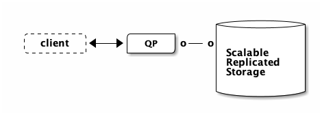
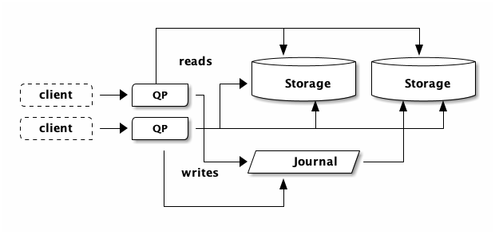

#+title: Aurora DSQL: Pushdown Compute Engine
#+setupfile: ../templates/level0.org
#+date: <2025-09-04 Thu>
#+options: ^:{}

* Aurora DSQL: Pushdown Compute Engine

In the DSQL architecture, the PostgreSQL-based query processor (QP) does not run
on the same physical machine as the storage engine. Disaggregated storage is not
a new concept for relational databases. Aurora PostgreSQL looks like this:

#+header: :exports results
#+begin_src ditaa :file images/disagg-storage.png :noeval
                             +------------+
 /--------\     /------+     | {s}        |
 | client |<--->|  QP  |o---o|            |
 \-=------+     +------/     | Scalable   |
                             | Replicated |
                             | Storage    |
                             |            |
                             +------------+
#+end_src

#+RESULTS:

In Aurora PostgreSQL (or Aurora MySQL), /commits/ are made durable by the remote
storage system, which replicates data across three Availability Zones. This
design has several advantages. The biggest advantage is that if the QP crashes,
no data is lost, because committed data has been synchronously replicated
off-host. This means you can bring another node online, which will attach to
the storage layer and therefore have all the data.

This design also makes caching easy. The leader QP is the /only/ node that can
change data. Therefore, the QP can locally manage a cache and avoid going to
storage when looking up data it has in the cache.

Why does this matter? Reading from memory is way faster than reading from the
network ([[https://gist.github.com/jboner/2841832][Latency Numbers Every Programmer Should Know]] is dated, but the intra-AZ
value is still roughly correct). In SQL, it is common to read many values as
part of a single query, so you really don't want to be going over the network
too often.

Read replicas can also attach to the storage layer. These replicas also have a
cache (for the same reason: latency). Therefore, these replicas are /eventually
consistent/ since they can never know /for sure/ if their local cache is up to
date or not. In order to keep data as fresh as possible, there are broadcast
mechanisms between components to keep data as fresh as possible.

If you want to learn more about this architecture, I highly recommend watching
[[https://www.youtube.com/watch?v=kVVdHezNTpw][AWS re:Invent 2024 - Deep dive into Amazon Aurora and its innovations (DAT405)]].

** Active-active

DSQL does things a little differently. In my article [[file:dsql-circle-of-life.org][the Circle of Life]], we talk
about how DSQL's design can scale both the QP and storage layers without
any explicit leaders, and without introducing eventual consistency. So,
something like this:

In the picture above, each client is able to do /reads and writes/, despite being
connected to a different QP. We've also scaled storage out, without introducing
eventual consistency. This architecture enables /active-active/ use-cases. DSQL
clusters are always /active-active/ across Availability Zones (within an AWS
Region). Multiple clusters can be /peered/ together to provide active-active
across AWS Regions (and Availability Zones).

There are other benefits to this design choice. If a QP (or storage node, etc.)
fails, only a tiny fraction of your traffic is impacted (a single connection),
and there is no need to wait for a replacement instance to be booted up. Simply
reconnect (which most libraries or frameworks will do for you), and carry on.

But there's a wrinkle too: we've lost the ability to maintain a write-through
cache in the QP because /any other QP/ can modify the data at any time. Each QP
/could/ subscribe to the journal to invalidate its local cache, but at least for
now, that's not how DSQL works.

** Bytes per second

The QP and storage boxes are about 0.5ms RTT apart, but that's not the only
challenge. They're also bandwidth constrained. Networks are pretty fast, but
there is still finite bandwidth. At 1000Mbps, loading 100MB takes 1 second.

Therefore, any solution that can reduce the number of roundtrips between the QP
and storage /or/ the time taken to return data to the QP is going to have a big
impact on query performance.

For the rest of this article, we're going to talk about that second piece:
reducing the time taken to return data. Both matter, and I'll write more about
the roundtrips in the future.

** Fewer bytes, less time

The Pushdown Compute Engine (PCE) is a component that runs /on storage/. Its
job is to reduce the number of bytes going back to the QP. If we send fewer
bytes back, then at any given throughput (bytes per second), we'll spend less
time.

Let's make a table:

#+begin_src sql
create table users (
    id int primary key,
    age int,
    name text
)
#+end_src

This table has a single index (on primary key). Let's insert some rows:

#+begin_src sql
insert into users
  select *, random() * 50, md5(random()::text) from generate_series(1, 1000)
#+end_src

Now, let's see what happens when fetch all the users:

#+begin_src sql
explain analyze select * from users
#+end_src

#+begin_src sql
                                                            QUERY PLAN
----------------------------------------------------------------------------------------------------------------------------------
 Index Only Scan using users_pkey on users  (cost=225.03..243.03 rows=1000 width=39) (actual time=1.590..9.692 rows=1000 loops=1)
   -> Storage Scan on users_pkey (cost=225.03..243.03 rows=1000 width=39) (actual rows=1000 loops=1)
       Projections: id, age, name
       -> B-Tree Scan on users_pkey (cost=225.03..243.03 rows=1000 width=39) (actual rows=1000 loops=1)
 Planning Time: 0.664 ms
 Execution Time: 9.754 ms
#+end_src

#+begin_aside
=EXPLAIN $query= asks the query planner what it would do if it were to run the
given query. =EXPLAIN ANALYZE= goes a step further and actually runs the query.
This gives you more information, such as how long things took.
#+end_aside

This query plan is telling us we're scanning the primary key index which
contains 1000 rows, and we're asking for the =(id, age, name)= tuple (which so
happens to be all the fields). This is the first feature PCE has: *projections*.
Instead of fetching everything, we can just fetch the id:

#+begin_src sql
explain analyze select id from users;
                                                           QUERY PLAN
---------------------------------------------------------------------------------------------------------------------------------
 Index Only Scan using users_pkey on users  (cost=225.03..243.03 rows=1000 width=4) (actual time=1.548..8.531 rows=1000 loops=1)
   -> Storage Scan on users_pkey (cost=225.03..243.03 rows=1000 width=4) (actual rows=1000 loops=1)
       Projections: id
       -> B-Tree Scan on users_pkey (cost=225.03..243.03 rows=1000 width=4) (actual rows=1000 loops=1)
 Planning Time: 0.038 ms
 Execution Time: 8.592 ms
(6 rows)
#+end_src

This query plan now has =Projections: id=, which means that we're going to
return fewer bytes over the wire. That saved us about 1ms. Not very scientific
with N=1, but you get the idea.

Let's do a little math.

#+begin_src sql
select
  pg_column_size(users.id) as id,
  pg_column_size(users.age) as age,
  pg_column_size(users.name) as name
from users limit 1

 id | age | name
----+-----+------
  4 |   4 |   36
(1 row)
#+end_src

So... fetching 1,000 rows will be 4,000 bytes if we only fetch the ids, or
44,000 bytes if we fetch all columns. That's not exactly right, because there is
some additional overhead, but it'll do.

\begin{equation}
delta\_bytes = 44000 - 4000 = 40000
\end{equation}
\begin{equation}
delta\_time = 9.7ms - 8.5ms = 1.2ms
\end{equation}
\begin{equation}
bytes\_per\_second = \dfrac{40000}{0.0012} =~ 267 Mbps
\end{equation}

Not too bad. With 4 QPs, you can do 1 Gbps.

** Filtering rows

PCE is also capable of pushing down filters to storage. Our test table only has
an index on the primary key. What if we wanted to find a user by name?

#+begin_src sql
explain analyze
   select * from users
   where name = 'a811e2411b325eb5730f907a0c53d73f'

                                                    QUERY PLAN
-------------------------------------------------------------------------------------------------------------------
 Full Scan (btree-table) on users  (cost=225.03..249.53 rows=1 width=39) (actual time=1.292..5.267 rows=1 loops=1)
   -> Storage Scan on users (cost=225.03..249.53 rows=1 width=39) (actual rows=1 loops=1)
       Projections: id, age, name
       Filters: (name = 'a811e2411b325eb5730f907a0c53d73f'::text)
       Rows Filtered: 999
       -> B-Tree Scan on users (cost=225.03..249.53 rows=1000 width=39) (actual rows=1000 loops=1)
 Planning Time: 0.081 ms
 Execution Time: 5.299 ms
(8 rows)
#+end_src

This query plan says it's going to *filter* the result set /at storage/. Because
we used =EXPLAIN ANALYZE= and not just =EXPLAIN=, we see that 999 rows were
filtered out, and only 1 row was returned.

DSQL's PCE engine /currently/ only supports a subset of what PostgreSQL supports
in =WHERE= clauses. For example, this query adds a function that PCE doesn't
yet support:

#+begin_src sql
explain analyze
    select * from users
    where lower(name) = 'a811e2411b325eb5730f907a0c53d73f'

                                                         QUERY PLAN
-----------------------------------------------------------------------------------------------------------------------------
 Index Only Scan using users_pkey on users  (cost=225.03..243.03 rows=5 width=39) (actual time=1.556..9.804 rows=1 loops=1)
   Filter: (lower(name) = 'a811e2411b325eb5730f907a0c53d73f'::text)
   Rows Removed by Filter: 999
   -> Storage Scan on users_pkey (cost=225.03..243.03 rows=1000 width=39) (actual rows=1000 loops=1)
       Projections: id, age, name
       -> B-Tree Scan on users_pkey (cost=225.03..243.03 rows=1000 width=39) (actual rows=1000 loops=1)
 Planning Time: 0.066 ms
 Execution Time: 9.836 ms
(8 rows)
#+end_src

What do you see? Two things. First, query time went up to about the same
duration as it took to read all rows. Second, the "Rows Removed by Filter: 999"
is no longer part of the "Storage Scan" node in the query plan. This means we
sent 1000 rows back to the QP (which takes time), only to throw nearly all of
them away.

** Aggregations

PCE also capable of running *aggregation* functions such as =count()=, =sum()=,
=min()=, and =max()=. However, this functionality is currently not enabled. So,
if you run:

#+begin_src sql
select count(*) from very_large_table
#+end_src

That's not going to perform super well, as each row will go back to the QP. If
you analyze that query, you'll see that DSQL sends an empty projection back and
not the entire row. This saves bytes/sec over the network, but it's not as
optimal as simply sending a single result back.

#+begin_aside
As this table grows, DSQL will automatically partition the table over
more storage nodes, which will speed up the row-by-row count because the QP will
query storage partitions in parallel.
#+end_aside

** Supported data types

Find out for yourself with:

#+begin_src sql
select name from sys.supported_datatypes() where supported_in_pushdown = true
#+end_src

I'm not going to include the list here, because I don't want this article to
become stale as we add additional type support.

** Summary

In this post, we've looked at one of the techniques that DSQL uses to improve
query performance: returning fewer bytes over the network. The Pushdown Compute
Engine supports *projections* (SQL =SELECT=), *filters* (SQL =WHERE=), and
common aggregation functions (such as =sum()=). This allows DSQL to discard or
transform rows or columns close to the data.

PCE is not (yet) fully compatible with all the PostgreSQL data types and
functions. For the DSQL release (just 3 months ago!), we implemented the most
commonly used types and functions following the Pareto principle. Support is
only going to improve over time. As always, we greatly appreciate any feedback
on what queries matter to you.

Thanks for reading!
