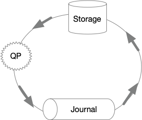

#+TITLE: marc-bowes.com

* [[file:/Users/bowes/code/blog/src/org/content/dsql-pce.org][Aurora DSQL: Pushdown Compute Engine]]
:PROPERTIES:
:RSS_PERMALINK: dsql-pce.html
:PUBDATE:  2025-09-04
:ID:       8818d9eb-2944-4179-bd86-cb9dfb87a918
:END:
#+setupfile: ../templates/level0.org
Aurora DSQL: Pushdown Compute Engine

In the DSQL architecture, the PostgreSQL-based query processor (QP) does not run
on the same physical machine as the storage engine. Disaggregated storage is not
a new concept for relational databases. Aurora PostgreSQL looks like this:

#+header: :exports results
#+begin_src ditaa :file images/disagg-storage.png :noeval
                            +------------+
/--------\     /------+     | {s}        |
* [[file:/Users/bowes/code/blog/src/org/content/dsql-tpcb.org][DSQL sucks at TPC-B]]
:PROPERTIES:
:RSS_PERMALINK: dsql-tpcb.html
:PUBDATE:  2025-07-02
:ID:       ae5bfb68-a623-45fd-9413-d45aa5067799
:END:
#+setupfile: ../templates/level0.org
DSQL sucks at TPC-B

Recently Kate Gowron from DoiT published [[https://engineering.doit.com/comparing-aurora-distributed-sql-vs-aurora-serverless-v2-a-practical-cost-analysis-f7cf9cd2dbf8][Comparing Aurora DSQL vs. Aurora
Serverless v2: A Practical Cost Analysis]] on Medium.

I don't know Kate personally, but I was quite excited when this article came
out. When we announced the Preview of Aurora DSQL at re:Invent last year, Kate
and team made a fantastic video on the DoiT YouTube channel:
* [[file:/Users/bowes/code/blog/src/org/content/dsql-tcpb.org][DSQL sucks at TPC-B]]
:PROPERTIES:
:RSS_PERMALINK: dsql-tcpb.html
:PUBDATE:  2025-07-02
:ID:       3006236d-ace0-457d-a461-da0775edd7a2
:END:
#+setupfile: ../templates/level0.org
DSQL sucks at TPC-B

This page is a redirect to [[file:dsql-tpcb.org]] because I can't spell.
* [[file:/Users/bowes/code/blog/src/org/content/dsql-scales-to-zero.org][Aurora DSQL scales to zero]]
:PROPERTIES:
:RSS_PERMALINK: dsql-scales-to-zero.html
:PUBDATE:  2025-06-18
:ID:       d4483a37-a163-4961-a9fb-afd863cd6f88
:END:
#+setupfile: ../templates/level0.org
Aurora DSQL scales to zero

The [[https://aws.amazon.com/rds/aurora/dsql/][Amazon Aurora DSQL]] landing page leads with:

#+begin_quote
Amazon Aurora DSQL is the fastest serverless distributed SQL database for always
available applications. Aurora DSQL offers the fastest multi-Region reads and
writes. It makes it effortless for customers to scale to meet any workload
demand with zero infrastructure management and zero downtime maintenance.
#+end_quote
* [[file:/Users/bowes/code/blog/src/org/content/dsql-auth-troubleshooting.org][Troubleshooting problems with DSQL auth]]
:PROPERTIES:
:RSS_PERMALINK: dsql-auth-troubleshooting.html
:PUBDATE:  2025-06-10
:ID:       65a8b031-fb18-437c-8837-d20b24d92404
:END:
#+setupfile: ../templates/level0.org

Troubleshooting problems with DSQL auth

In this article, we'll look at some of the common ways folks get tripped up
configuring their clients and credentials.

Before continuing, I recommend reading [[file:dsql-auth.org][Aurora DSQL: How authentication and
authorization works]], which should give you a robust mental model of how things
work end to end.
* [[file:/Users/bowes/code/blog/src/org/content/dsql-avoid-hot-keys.org][Aurora DSQL Best Practices: Avoid Hot keys]]
:PROPERTIES:
:RSS_PERMALINK: dsql-avoid-hot-keys.html
:PUBDATE:  2025-06-06
:ID:       ac4400fd-8c64-4cea-98b8-65fea8d588c5
:END:
#+setupfile: ../templates/level0.org
Aurora DSQL Best Practices: Avoid hot keys

In the [[file:dsql-circle-of-life.org][Circle of Life]], I describe the /flow/ of data in Aurora DSQL. Data flows
from the Query Processor (QP), through the journal, and into storage. Once in
storage, it can be queried by future transactions.

* [[file:/Users/bowes/code/blog/src/org/content/dsql-how-to-spend-a-dollar.org][Aurora DSQL: How to spend a dollar]]
:PROPERTIES:
:RSS_PERMALINK: dsql-how-to-spend-a-dollar.html
:PUBDATE:  2025-06-02
:ID:       3c7c98ab-b516-4cf4-89b6-c522eeba84a5
:END:
#+setupfile: ../templates/level0.org
Aurora DSQL: How to spend a dollar

From [[https://aws.amazon.com/rds/aurora/dsql/pricing/][Amazon Aurora DSQL pricing]]:

#+begin_quote
Aurora DSQL measures all request-based activity, such as query processing,
reads, and writes, using a single normalized billing unit called Distributed
Processing Unit (DPU). Storage is billed based on the total size of your
database, measured in GB-month. Aurora DSQL ensures your data is available and
strongly consistent across three Availability Zones in an AWS Region. You are
only charged for one logical copy of your data.
#+end_quote
* [[file:/Users/bowes/code/blog/src/org/content/dsql-circle-of-life.org][Aurora DSQL and the Circle of Life]]
:PROPERTIES:
:RSS_PERMALINK: dsql-circle-of-life.html
:PUBDATE:  2025-05-23
:ID:       e905283a-c158-4b68-8878-6516e1d85892
:END:
#+setupfile: ../templates/level0.org
Aurora DSQL and the Circle of Life

#+header: :exports results
#+begin_src ditaa :file images/circle0.png :noeval
          +------------+
reads     | {s}        |  apply changes
    +---->|   Storage  |<----+
| +------------+ |
/--------\     /------+                     |
* [[file:/Users/bowes/code/blog/src/org/content/postgres-direct-tls.org][How direct TLS can speed up your connections]]
:PROPERTIES:
:RSS_PERMALINK: postgres-direct-tls.html
:PUBDATE:  2025-05-21
:ID:       77b97aa7-629f-4bc5-a62d-39fba03152ef
:END:
#+setupfile: ../templates/level0.org
How direct TLS can speed up your connections

A few months ago, one of my Aurora DSQL teammates reported a curious finding.
When connecting to their DSQL clusters using the corporate VPN, their
connections were fast and snappy - as they should be! But, when connecting
/without using the VPN/, their connections were taking around 3 seconds.
Curiously, this was only happening when in the AWS offices.

** Discovery
:PROPERTIES:
:ID:       0709c895-5738-442b-b538-7e0846e8a050
:END:

The trigger for this discovery was the public Preview of Aurora DSQL at
re:Invent 2024. Before the public release, access to DSQL had been restricted,
requiring developers to be on the corporate VPN. Developers started to interact
with DSQL off-VPN, and realized it was slower - way slower - than before.
* [[file:/Users/bowes/code/blog/src/org/content/dsql-auth.org][Aurora DSQL: How authentication and authorization works]]
:PROPERTIES:
:RSS_PERMALINK: dsql-auth.html
:PUBDATE:  2025-05-13
:ID:       892cf8c8-42de-4c28-8d57-d3682de95dba
:END:
#+setupfile: ../templates/level0.org
Aurora DSQL: How authentication and authorization works

In this article, I'm going to explain how connections to Aurora DSQL are
authenticated and authorized. This information is meant to be supplemental to
what is found in the official [[https://docs.aws.amazon.com/aurora-dsql/][Amazon Aurora DSQL]] documentation.

This is a "nuts and bolts" explanation, rather than a "how to" guide. After
reading this article you should understand:
